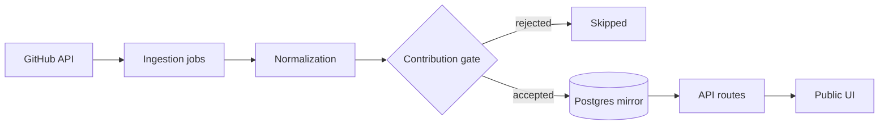

# OpenDeck

A public discovery engine for open source repositories that are actually ready for a contribution. OpenDeck mirrors curated GitHub project data into Postgres, scores every repository for contribution readiness and serves the result from its own database, so browsing stays fast and never depends on the GitHub API.

[](https://opendeck.akasewang.me)
[](#)
[](#)
[](#)
[](#)
[](#)
[](#)
[](#)
[](#)
[](#)


---

## What it does

Most "find an open source project" tools rank by stars. OpenDeck ranks by whether you could realistically open a pull request this week.

| Capability | How it works |
| :-- | :-- |
| **Contribution gate** | Every candidate is scored before it is stored. A repository is only indexed if it is public, active, licensed, has a primary language, has open issues and carries description or README context. |
| **Curated corpus** | Discovery is bounded at **1300 repositories**. Once the cap is reached, ingestion refreshes what is known instead of endlessly widening the pool. |
| **Noise filtering** | Resource lists, roadmaps, interview prep collections, forks, mirrors, templates and archived repositories are rejected outright. |
| **Fast by default** | Public pages read from the Postgres mirror. GitHub is called by background jobs, not by visitors. |
| **Account workspace** | Save repositories, build collections, follow orgs, keep private notes, track contribution stage, request alerts on good first issues and export the lot. |

## Technology stack

- **Framework**: Next.js 15 (App Router) + React 19
- **Language**: TypeScript (strict mode)
- **Styling**: Tailwind CSS v4
- **Motion and primitives**: Framer Motion, Radix UI
- **Database**: Neon Postgres
- **ORM**: Drizzle ORM
- **Auth**: Email magic links, hashed session tokens
- **Email service**: Resend
- **Tooling**: Biome, ESLint, tsx test runner
- **Automation**: GitHub Actions, Vercel

## Quick start

```sh
npm install
cp .env.example .env    # add DATABASE_URL and GITHUB_TOKEN
npm run db:migrate
npm run dev
```

The app runs at `http://localhost:3000`. To populate a fresh database, run `npm run ingest:discovery` once, then `npm run ingest:trending`.

### Environment

| Variable | Scope | Required | Purpose |
| :-- | :-- | :-- | :-- |
| `DATABASE_URL` | server | yes | Postgres connection for the app and every operational command. |
| `NEXT_PUBLIC_APP_URL` | public | yes | Canonical URLs, sitemap entries and share previews. |
| `GITHUB_TOKEN` | server | yes | GitHub API reads. |
| `GH_INGEST_TOKEN` | server | no | Ingestion specific override. Falls back to `GITHUB_TOKEN`. |
| `AUTH_SECRET` | server | production | Signs session cookies. Minimum 32 characters in production. |
| `CRON_SECRET` | server | production | Protects the hosted ingestion trigger. |
| `EMAIL_FROM`, `RESEND_API_KEY` | server | production | Login links, digests and alerts. |
| `AUTH_ADMIN_EMAILS` | server | no | Comma separated. Only these emails, or users created through an admin invite, become admins. |
| `AUTH_ALLOWED_EMAILS`, `AUTH_ALLOWED_DOMAINS` | server | no | Comma separated signup allowlists. |
| `AUTH_INVITE_ONLY` | server | no | Set to `true` to require an invite link for signup. |

Authentication is email magic links only. Sign in opens as a modal from any page, and `/auth` survives only as a redirect for older links.

### Commands

| Command | Does |
| :-- | :-- |
| `npm run dev` / `build` / `start` | Next.js lifecycle. |
| `npm test` | Node test runner over `src/**/*.test.ts` via `tsx`. |
| `npm run lint` | ESLint plus Biome, warnings treated as errors. |
| `npm run typecheck` | `tsc --noEmit`. |
| `npm run format` | Biome formatter. |
| `npm run db:generate` / `db:migrate` | Author and apply Drizzle migrations. |
| `npm run ingest:discovery` | Full discovery sweep across search lanes. |
| `npm run ingest:trending` | Recently active contribution ready repositories. |
| `npm run ingest:metadata` | Refresh the stalest stored repositories. |
| `npm run auth:sync-admins` | Align `auth_users.role` with `AUTH_ADMIN_EMAILS`. Add `-- --apply` to write. |

Every operational command routes through the typed entrypoint in `src/operations/cli.ts`.

## Architecture



Discovery and trending jobs query focused GitHub search lanes defined in `src/features/ingestion/services/ingestion-sources.ts`. Results are normalized by `repository-ingestion-service.ts`, scored by `src/features/repositories/services/contribution-readiness.ts` and written with Drizzle. Public pages never touch the GitHub API during normal browsing.

### Ingestion schedule

Ingestion runs on GitHub Actions rather than platform crons, because the free hosting tier caps cron functions well below what a multi minute sweep needs.

| Workflow | Schedule | Work |
| :-- | :-- | :-- |
| `ingest-trending.yml` | hourly, `0 * * * *` | Refreshes recently active repositories. |
| `ingest-daily.yml` | daily, `0 2 * * *` UTC | Full discovery sweep, then refreshes the 50 stalest repositories. |

Both workflows also accept a manual `workflow_dispatch`. `/api/cron/ingest` remains available as an authenticated HTTP trigger.

### Source map

```text
src/
├── app/          pages, layouts, metadata routes, route handlers
├── components/   shared brand, layout, ui, effect and transition components
├── config/       app configuration and validated server environment access
├── db/           Drizzle schema and database client
├── features/     account · admin · auth · collections · dashboard
│                 ingestion · landing · organizations · repositories
├── hooks/        app wide client hooks
├── lib/          API inputs, email, GitHub, security, SEO
├── operations/   typed operational command entrypoints
└── utils/        generic pure helpers
drizzle/          migrations and snapshots
```

A feature owns the directories it needs from `api`, `components`, `constants`, `data`, `hooks`, `motion`, `providers`, `services`, `types` and `utils`. Browser facing API clients live in a feature's `api` directory, server side domain workflows live in `services`. Code only graduates to `src/components`, `src/hooks` or `src/utils` once it is domain independent and reused across features.

Files are lowercase kebab-case, React components and types are PascalCase, functions and hooks are camelCase.

<details>
<summary><b>Pages</b></summary>

| Route | Purpose |
| :-- | :-- |
| `/` | Landing page with the animated repository scatter. |
| `/info` | Product explanation and project links. |
| `/dashboard` | Curated repository overview. |
| `/dashboard/trending` | Recently active contribution ready repositories. |
| `/dashboard/discover` | Filterable repository search. |
| `/dashboard/compare` | Repository comparison. |
| `/dashboard/organizations` | Organization summaries and mirrored repository detail. |
| `/dashboard/repos/[owner]/[repo]` | Repository detail workspace. |
| `/dashboard/home` | Account workspace: saved repos, collections, follows, pipeline, preferences, exports, sessions. |
| `/dashboard/admin` | Admin only user, invite and allowlist management. |
| `/shared/collections/[slug]` | Public shared collection page. |

</details>

<details>
<summary><b>API routes</b></summary>

**Public.** `/api/curated`, `/api/github-trending`, `/api/github-discover`, `/api/organizations`, `/api/search`, `/api/repos/compare`, `/api/repos/detail`, `/api/repos/document`, `/api/github-stars`, `/api/shared/collections/[slug]`

**Session required.** `/api/github-overview`, `/api/organizations/profile`, `/api/repos/contributors`, `/api/account/*`

**Admin.** `/api/admin/*`

**Auth.** `/api/auth/magic-link`, `/api/auth/magic-link/callback`, `/api/auth/session`, `/api/auth/sign-out`

**Scheduled.** `/api/cron/ingest`, `/api/cron/account-alerts`

List style endpoints stay public. The detail endpoints behind dashboard row expansion require a valid account session. Route handlers validate enum like query values and keep public response shapes stable.

</details>

## Security

- **Secrets stay server side.** They are read only through `src/config/server-env.ts`. Client code never imports the database client, GitHub token rotation or ingestion modules. Only `NEXT_PUBLIC_APP_URL` is public.
- **Sessions.** Magic link auth with HTTP only, same site cookies backed by hashed session tokens in Postgres.
- **Input validation.** Route handlers validate enum like values such as repository sort, curated source and ingest kind. Repository full names are validated before any GitHub contributor lookup. Errors return stable public shapes and never leak stack traces.
- **Headers.** `next.config.ts` sets conservative security headers, and production adds HSTS. A full Content Security Policy is deliberately deferred until every external asset, font, image and API source is verified in the deployed environment.
- **Known gap.** Rate limiting is in memory, which is not reliable across serverless instances. Abuse prone public endpoints need a shared store or edge rate limiting before heavy traffic.

## Verification

```sh
npm test
npm run lint
npm run typecheck
npm run build
npm audit --omit=dev
```

## Deployment

Set `DATABASE_URL`, `NEXT_PUBLIC_APP_URL`, `GITHUB_TOKEN`, `GH_INGEST_TOKEN`, `CRON_SECRET`, `AUTH_SECRET`, `EMAIL_FROM` and `RESEND_API_KEY` in the hosting environment. Run migrations before relying on ingestion, magic link authentication, alerts or digests. The GitHub Actions workflows read `DATABASE_URL` and `GH_INGEST_TOKEN` from repository secrets.

## License

Licensed under [Creative Commons Attribution-NonCommercial-ShareAlike 4.0 International](https://creativecommons.org/licenses/by-nc-sa/4.0/). See [`LICENSE`](LICENSE).

Copyright (c) 2026 Akash Dewangan.
