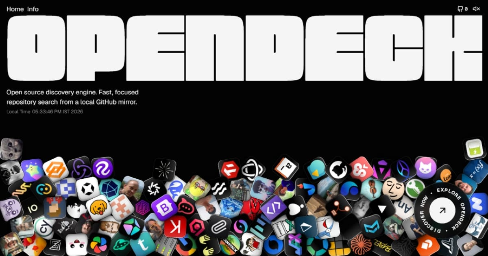
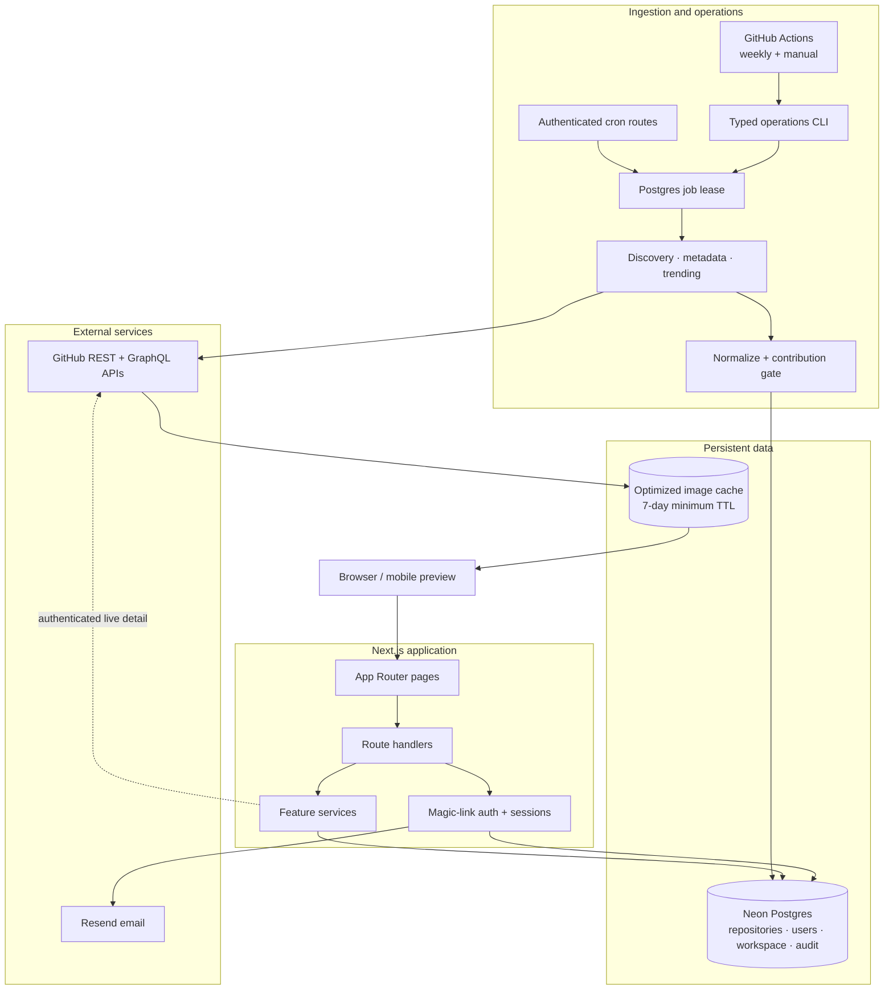
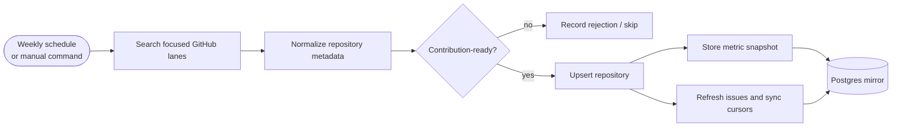
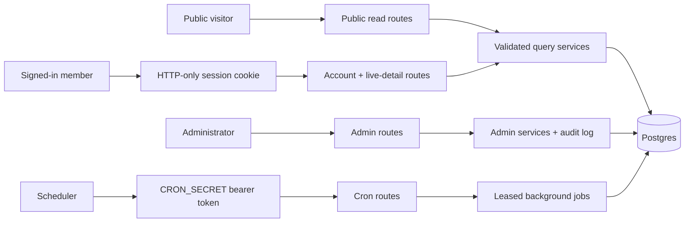

<h1 align="center">OpenDeck</h1>

<p align="center">
  A contribution-first discovery engine for finding open-source repositories that are
  active, documented, licensed and ready for a pull request.
</p>

<p align="center">
  <a href="https://opendeck.akasewang.me"><strong>Open the live site</strong></a>
</p>

<p align="center">
  
  
  
  
  
</p>

<p align="center">
  <a href="#how-it-works">How it works</a> ·
  <a href="#architecture">Architecture</a> ·
  <a href="#getting-started">Getting started</a> ·
  <a href="#development">Development</a> ·
  <a href="#operations">Operations</a> ·
  <a href="#security-boundary">Security</a> ·
  <a href="#deployment">Deployment</a>
</p>

> OpenDeck is an independent project and is not affiliated with or endorsed by GitHub.



---

## How it works

OpenDeck does not rank repositories by stars alone. Scheduled ingestion searches focused GitHub
lanes, normalizes every candidate and applies a contribution-readiness gate before admitting it to
the local mirror. The application then serves discovery, comparison and organization views from
Postgres instead of repeating expensive GitHub searches for every visitor.

### What qualifies as contribution-ready

A repository must pass every blocking check:

| Signal | Requirement |
| --- | --- |
| Project type | Public; not archived, forked, mirrored, templated or a resource list |
| Activity | Pushed within the last 365 days |
| Ownership | A detectable primary language and license |
| Work | At least one open issue |
| Context | A description or README excerpt |

Good-first-issue, help-wanted and beginner-friendly signals increase the score, as do recent
activity, useful project context, forks and a healthy star range. The score is bounded from 0 to
100, but a high score never overrides a blocking check.

### Product capabilities

| Area | What OpenDeck provides |
| --- | --- |
| Discovery | Curated, trending and filterable repository feeds |
| Evaluation | Contribution score, activity, issues, documentation and side-by-side comparison |
| Organizations | Mirrored organization and repository summaries |
| Workspace | Saved repositories, collections, follows, searches, notes and contribution pipeline |
| Sharing | Public collection links |
| Automation | Issue alerts, digests, metadata refreshes and weekly repository ingestion |
| Administration | Users, invites, allowlists, roles and audit history |

---

## Architecture

### System at a glance


```mermaid
flowchart TB
  subgraph sources["External services"]
    GITHUB["GitHub REST + GraphQL APIs"]
    RESEND["Resend email"]
  end

  subgraph automation["Ingestion and operations"]
    ACTIONS["GitHub Actions<br/>weekly + manual"]
    CLI["Typed operations CLI"]
    CRON["Authenticated cron routes"]
    LEASE["Postgres job lease"]
    INGEST["Discovery · metadata · trending"]
    GATE["Normalize + contribution gate"]
  end

  subgraph data["Persistent data"]
    DB[("Neon Postgres<br/>repositories · users · workspace · audit")]
    IMAGES[("Optimized image cache<br/>7-day minimum TTL")]
  end

  subgraph application["Next.js application"]
    ROUTES["App Router pages"]
    API["Route handlers"]
    SERVICES["Feature services"]
    AUTH["Magic-link auth + sessions"]
  end

  BROWSER["Browser / mobile preview"]

  ACTIONS --> CLI
  CRON --> LEASE
  CLI --> LEASE
  LEASE --> INGEST
  INGEST --> GITHUB
  INGEST --> GATE
  GATE --> DB

  BROWSER --> ROUTES
  ROUTES --> API
  API --> SERVICES
  SERVICES --> DB
  API --> AUTH
  AUTH --> DB
  AUTH --> RESEND
  SERVICES -. authenticated live detail .-> GITHUB
  GITHUB --> IMAGES
  IMAGES --> BROWSER
```

The repository mirror is the source of truth for normal discovery and list views. A small number
of bounded operations—such as repository documents, contributors and this project's star count—
call GitHub through the shared client with timeouts, retries, token rotation and rate-limit
handling.

### Ingestion pipeline


```mermaid
flowchart LR
  START(["Weekly schedule<br/>or manual command"])
  SEARCH["Search focused GitHub lanes"]
  NORMALIZE["Normalize repository metadata"]
  CHECK{"Contribution-ready?"}
  SKIP["Record rejection / skip"]
  UPSERT["Upsert repository"]
  SNAPSHOT["Store metric snapshot"]
  REFRESH["Refresh issues and sync cursors"]
  MIRROR[("Postgres mirror")]

  START --> SEARCH
  SEARCH --> NORMALIZE
  NORMALIZE --> CHECK
  CHECK -- no --> SKIP
  CHECK -- yes --> UPSERT
  UPSERT --> SNAPSHOT
  UPSERT --> REFRESH
  SNAPSHOT --> MIRROR
  REFRESH --> MIRROR
```

Discovery is spread across focused search lanes: repositories actively inviting contributors
(good-first-issue and help-wanted labels), up-for-grabs and beginner-friendly projects, actively
maintained tools, and language ecosystems including TypeScript, Python, Rust, Go, JavaScript and
Java. Lanes bias toward recently pushed, sweet-spot sized repositories with a healthy but not
overwhelming issue backlog. The corpus target is 500 repositories;
after it is reached, ingestion refreshes the mirror instead of widening it indefinitely.

Every ingestion entry point shares a 20-minute Postgres lease, so a scheduled run, manual CLI run
and HTTP trigger cannot process the same repository workload at the same time.

### Request and trust boundaries


```mermaid
flowchart LR
  PUBLIC["Public visitor"] --> PUBLIC_API["Public read routes"]
  MEMBER["Signed-in member"] --> COOKIE["HTTP-only session cookie"]
  COOKIE --> MEMBER_API["Account + live-detail routes"]
  ADMIN["Administrator"] --> ADMIN_API["Admin routes"]
  SCHEDULER["Scheduler"] --> BEARER["CRON_SECRET bearer token"]
  BEARER --> CRON_API["Cron routes"]

  PUBLIC_API --> QUERY["Validated query services"]
  MEMBER_API --> QUERY
  ADMIN_API --> AUDIT["Admin services + audit log"]
  CRON_API --> JOBS["Leased background jobs"]

  QUERY --> DB[("Postgres")]
  AUDIT --> DB
  JOBS --> DB
```

### Module ownership

| Path | Responsibility |
| --- | --- |
| `src/app/` | Pages, layouts, metadata and HTTP route handlers |
| `src/features/` | Domain-owned UI, API clients, services, types and state |
| `src/components/` | Shared UI, layout, brand, effects and transitions |
| `src/config/` | Application settings, design tokens, routes and server environment access |
| `src/db/` | Drizzle schema and database client |
| `src/lib/api/` | Request parsing, validation, errors, caching and HTTP helpers |
| `src/lib/github/` | GitHub clients, token rotation, documents, Markdown and avatar handling |
| `src/lib/security/` | Database rate limiting and cron authentication |
| `src/operations/` | Typed CLI entry point and operational commands |
| `scripts/` | TypeScript development launcher and regression tests |
| `drizzle/` | Versioned database migrations and snapshots |
| `.github/workflows/` | CI and scheduled ingestion |

Feature code remains inside its domain until it is genuinely shared. Browser-facing API clients
live under each feature's `api/` directory; server workflows live under `services/`.

<details>
<summary><strong>Main application routes</strong></summary>

| Route | Purpose |
| --- | --- |
| `/` | Landing page and animated repository scatter |
| `/info` | Product explanation and project links |
| `/dashboard` | Curated repository overview |
| `/dashboard/trending` | Recently active repositories |
| `/dashboard/discover` | Filterable repository search |
| `/dashboard/compare` | Side-by-side repository comparison |
| `/dashboard/organizations` | Organization summaries |
| `/dashboard/repos/[owner]/[repo]` | Repository detail workspace |
| `/dashboard/home` | Personal workspace |
| `/dashboard/admin` | Administrative controls |
| `/shared/collections/[slug]` | Public shared collection |

</details>

---

## Getting started

### Prerequisites

- Node.js 22+
- npm
- PostgreSQL; the hosted project uses Neon
- A GitHub token for ingestion and live GitHub-backed details

```powershell
npm install
Copy-Item .env.example .env
```

Set at least `DATABASE_URL`, `NEXT_PUBLIC_APP_URL` and `GITHUB_TOKEN`, then initialize the database:

```powershell
npm run db:migrate
npm run ingest:discovery
npm run ingest:trending
npm run dev
```

The first discovery run populates the mirror. Later development sessions only need `npm run dev`.

---

## Development

### Local development

`npm run dev` starts Next.js on `localhost`. It first probes for a free port beginning at `3000`,
so when another process already holds `3000` it starts on the next open port and prints where it
is actually serving instead of reporting a port it never bound.

```powershell
npm run dev
```

### Mobile QR preview

`npm run dev:mobile` starts the same server on a LAN-accessible host and adds a phone preview. It:

1. filters loopback, link-local, Docker, WSL, VPN and virtual adapters
2. selects a LAN IPv4 address
3. starts Next.js on a free port bound to `0.0.0.0`
4. verifies the network URL over HTTP
5. prints the local URL, verified network URL and a compact square QR code

The verified host is added to Next.js `allowedDevOrigins`, so navigation, JavaScript, API requests,
animations and HMR work from the phone, not only the initial HTML page. If no LAN interface is
available or the network URL cannot be verified, the dev server keeps running locally and only the
QR preview is skipped.

Keep the phone and computer on the same non-guest Wi-Fi network, then scan the terminal QR code.

```powershell
npm run dev:mobile
```

Override incorrect automatic interface selection with either form:

```powershell
npm run dev:mobile -- --mobile-host 192.168.1.25
npm run dev:mobile -- --mobile-host my-computer.local --port 4000
```

```powershell
$env:DEV_MOBILE_HOST = '192.168.1.25'
npm run dev:mobile
```

### Image delivery

GitHub avatars use the Next.js image optimizer rather than loading directly in the browser.
OpenDeck requests only the sizes used by the interface, converts them to WebP and keeps optimized
responses cacheable for at least seven days. The weekly ingestion schedule uses the same cadence,
so repository refreshes and image-cache freshness remain aligned.

---

## Commands

| Command | Purpose |
| --- | --- |
| `npm run dev` | Start Next.js on `localhost`, choosing the first free port from `3000` |
| `npm run dev:mobile` | Start development with a verified LAN URL and mobile QR code |
| `npm run build` | Create the production build |
| `npm start` | Run the production build |
| `npm test` | Run application and development-launcher tests |
| `npm run lint` | Run ESLint and Biome with warnings treated as errors |
| `npm run typecheck` | Run strict TypeScript without emitting files |
| `npm run format` | Format the repository with Biome |
| `npm run db:generate` | Generate a Drizzle migration |
| `npm run db:migrate` | Apply pending migrations |
| `npm run ingest:discovery` | Search every discovery lane and update the mirror |
| `npm run ingest:trending` | Refresh recently active repositories |
| `npm run ingest:metadata` | Refresh the stalest stored repositories |
| `npm run auth:sync-admins` | Preview configured admin-role changes; add `-- --apply` to write |
| `npm run gen:colors` | Regenerate repository language colors |

Every operational command routes through `src/operations/cli.ts`.

---

## Configuration

| Variable | Required | Purpose |
| --- | --- | --- |
| `DATABASE_URL` | Yes | Postgres connection used by the app, auth and operations |
| `NEXT_PUBLIC_APP_URL` | Yes | Canonical absolute origin for metadata and magic links |
| `GITHUB_TOKEN` | Yes | GitHub API reads and local ingestion |
| `GH_INGEST_TOKEN` | No | Scheduled-ingestion override; falls back to `GITHUB_TOKEN` |
| `CRON_SECRET` | Production | Bearer secret protecting scheduled HTTP routes; minimum 32 characters |
| `AUTH_SECRET` | Production | HMAC key for sessions, opaque tokens and rate-limit keys; minimum 32 characters |
| `AUTH_ADMIN_EMAILS` | No | Comma-separated emails that receive the admin role |
| `AUTH_ALLOWED_EMAILS` | No | Comma-separated signup email allowlist |
| `AUTH_ALLOWED_DOMAINS` | No | Comma-separated signup-domain allowlist |
| `AUTH_INVITE_ONLY` | No | Set `true` to require an invite for new accounts |
| `EMAIL_FROM` | Production auth | Sender address used by Resend |
| `RESEND_API_KEY` | Production auth | Resend API key |
| `DEV_MOBILE_HOST` | Development | Override the LAN host encoded in the QR code |

In development, an unconfigured email provider returns the magic-link URL in the API response.
Production refuses to issue a usable login when email delivery is unavailable.

---

## Operations

### Weekly ingestion

`.github/workflows/ingest-weekly.yml` runs every Sunday at 02:00 UTC and can also be started with
`workflow_dispatch`.

| Step | Work |
| --- | --- |
| Discovery | Search all contribution-focused lanes |
| Metadata | Refresh the 50 stalest repositories |
| Trending | Refresh 50 recently active repositories |

The workflow uses read-only repository permissions, pinned action revisions, npm's dependency
cache and a non-cancelling ingestion concurrency group.

The same jobs can be triggered through `/api/cron/ingest` with
`Authorization: Bearer <CRON_SECRET>`. Query values and limits are validated before any work starts.

### Continuous integration

Every push and pull request runs:

```text
npm ci
npm audit --omit=dev --audit-level=high
npm run typecheck
npm run lint
npm test
npm run build
```

---

## Security boundary

- **Secrets remain server-side.** Server modules read them through `src/config/server-env.ts`;
  only `NEXT_PUBLIC_APP_URL` is public.
- **Passwordless authentication.** Magic-link and invite tokens are random, one-time, expiring and
  stored only as HMAC hashes.
- **Session protection.** Session tokens are hashed in Postgres and sent through HTTP-only,
  SameSite=Lax cookies; production cookies require HTTPS.
- **Signup controls.** Administrators can combine environment allowlists, database allowlists,
  invite-only mode and expiring role-bearing invites.
- **Shared rate limits.** Abuse-sensitive routes use atomic Postgres buckets keyed by an HMAC,
  rather than process memory.
- **Cron authorization.** Production cron routes require a constant-time compared bearer secret.
- **Input boundaries.** Route handlers validate repository names, UUIDs, enums, limits, redirect
  paths and repository document paths before use.
- **Safe repository documents.** Markdown is sanitized before it is returned to the application.
- **Operational locking.** Postgres leases prevent overlapping ingestion and automation runs.
- **Response hardening.** The application sets frame, MIME-sniffing, referrer, opener, resource and
  permissions headers; production also sets HSTS.
- **Auditability.** Administrative actions and email deliveries have dedicated database records.

GitHub tokens are rotated when multiple tokens are configured, parked when rate-limited and never
sent to the browser. The GitHub client applies request timeouts, bounded retries and rate-limit
backoff.

---

## Performance and caching

- Public API responses use explicit CDN cache policies with stale-while-revalidate windows.
- Private and error responses are not stored in shared caches.
- Repository feeds query the local Postgres mirror instead of repeating discovery searches.
- Metric snapshots preserve repository movement without duplicating the repository row.
- Optimized GitHub avatars use a seven-day minimum cache TTL and a bounded size list.
- Client searches are debounced, and feature API clients keep domain-specific cache state.

---

## Deployment

1. Provision PostgreSQL and configure the production environment variables.
2. Run `npm run db:migrate`.
3. Build with `npm run build`.
4. Deploy the Next.js application.
5. Add `DATABASE_URL` and `GH_INGEST_TOKEN` to GitHub Actions secrets.
6. Run the weekly ingestion workflow manually once to verify the production mirror.

The application currently targets a standard Next.js host and Neon Postgres. The mobile QR wrapper
is development-only and does not affect production builds or `npm start`.

---

## Verification

Run the same checks used by CI:

```powershell
npm audit --omit=dev --audit-level=high
npm run typecheck
npm run lint
npm test
npm run build
```

Database changes should also run:

```powershell
npx drizzle-kit check
```

---

## Troubleshooting

| Symptom | What to check |
| --- | --- |
| QR URL does not open | Same Wi-Fi, private-network firewall access and guest-network isolation |
| Wrong LAN address | Disconnect VPN/virtual adapters or pass `--mobile-host` |
| Mobile page is stale | Close the old tab, rescan, clear site data or use a private tab |
| Mobile page opens but HMR fails | Use the verified `Network URL`; do not replace it with `0.0.0.0` |
| No repositories appear | Run migrations, then discovery and trending ingestion |
| GitHub requests return 503 | Configure a valid token and inspect its rate-limit state |
| Login email is not sent | Configure `EMAIL_FROM` and `RESEND_API_KEY` |
| Cron route returns 401 | Send `Authorization: Bearer <CRON_SECRET>` |
| Ingestion is skipped | Another process owns the repository-ingestion lease |

---

## License

Licensed under the
[Creative Commons Attribution-NonCommercial-ShareAlike 4.0 International](https://creativecommons.org/licenses/by-nc-sa/4.0/).
See [`LICENSE`](LICENSE).

Copyright (c) 2026 Akash Dewangan.
